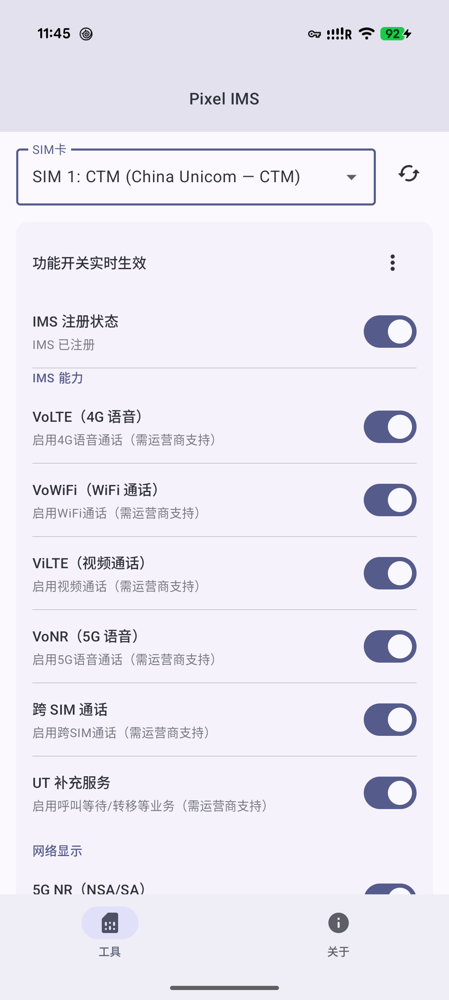
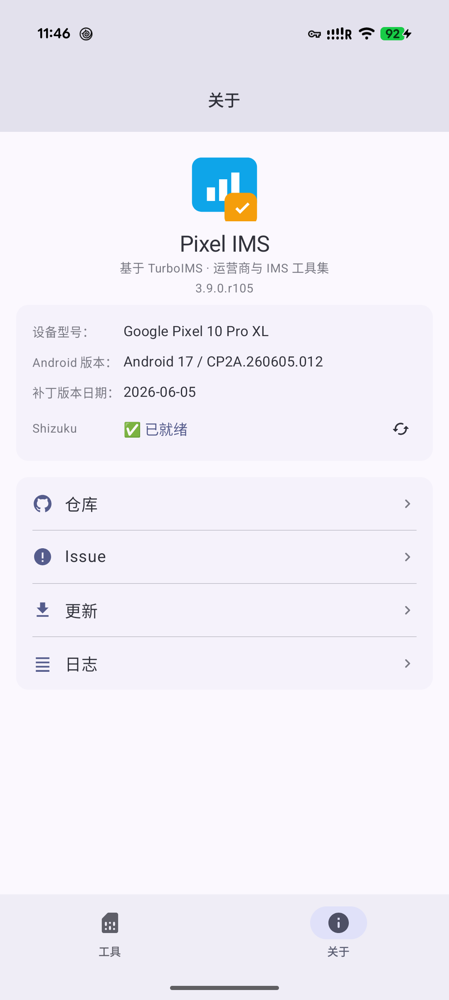

# Pixel IMS

<p align="center">
  
</p>

<p align="center">
  <strong>Carrier and IMS toolkit for Google Pixel</strong><br/>
  Tune VoLTE / VoWiFi / VoNR, 5G display behavior, and network compatibility with Shizuku privileges.
</p>

<p align="center">
  <a href="README.md">中文（默认）</a> | English
</p>

<p align="center">
  <a href="https://github.com/Chenfyuan/carrier-ims-for-pixel/releases"></a>
  <a href="LICENSE"></a>
  
  
  
</p>

## Positioning

A personal maintenance fork based on [ryfineZ/carrier-ims-for-pixel](https://github.com/ryfineZ/carrier-ims-for-pixel), with commercial modules (ads/donations/business cooperation) removed for a clean IMS tool experience.

## Screenshots

<p align="center">
  
  
</p>

## Feature Matrix

| Module | Capability | Notes |
|---|---|---|
| System Info | app/device/patch/Shizuku status | quick environment visibility |
| IMS Registration | status query + manual register | one-tap register workflow |
| Carrier Features | VoLTE / VoWiFi / ViLTE / VoNR / UT / Cross-SIM | realtime switches, rollback on failure |
| 5G Features | 5G NR / 5G signal threshold / 5G+ icon | optimized for common CN scenarios |
| Network Fix | captive portal one-tap fix | fixes restricted/exclamation network states |
| TikTok Fix | no-network fix for TikTok (Mainland SIM) | shown only for Mainland SIM |
| Diagnostics | logs / full config view / issue shortcut | submit issues with useful context |
| In-app Update | check, download, install updates | integrated with GitHub Releases |

## Quick Start

1. Download APK from [Releases](https://github.com/Chenfyuan/carrier-ims-for-pixel/releases)
2. Install and start [Shizuku](https://shizuku.rikka.app/)
3. Open app and grant Shizuku permission
4. Select SIM and toggle required features

## Requirements

- Pixel Tensor devices (Pixel 6/7/8/9/10, Fold, Tablet)
- Android 13+
- Shizuku running and authorized

## Build (Developers)

```bash
./gradlew :app:assembleDebug
adb install -r app/build/outputs/apk/debug/app-debug.apk
```

If local signing is required, configure `local.properties`:

```properties
SIGN_KEY_STORE_FILE=/path/to/your.keystore
SIGN_KEY_STORE_PASSWORD=***
SIGN_KEY_ALIAS=***
SIGN_KEY_PASSWORD=***
```

## FAQ

### IMS not registered

- Confirm Shizuku is ready
- Verify VoLTE / VoWiFi availability
- Collect logs and submit an issue

### Network has signal but no internet

- Check APN first
- Then try the network verification fix

### TikTok still unavailable

- TikTok fix switch only appears for Mainland SIM
- Restart target app or refresh its session after changes

## Credits

- [ryfineZ/carrier-ims-for-pixel](https://github.com/ryfineZ/carrier-ims-for-pixel)
- [Mystery00/TurboIMS](https://github.com/Mystery00/TurboIMS)
- [vvb2060/Ims](https://github.com/vvb2060/Ims)
- [kyujin-cho/pixel-volte-patch](https://github.com/kyujin-cho/pixel-volte-patch)
- [nullbytepl/CarrierVanityName](https://github.com/nullbytepl/CarrierVanityName)

## Disclaimer

This app modifies carrier-related system configuration for learning, testing, and personal tuning purposes. Use at your own risk.

## License

Apache-2.0
